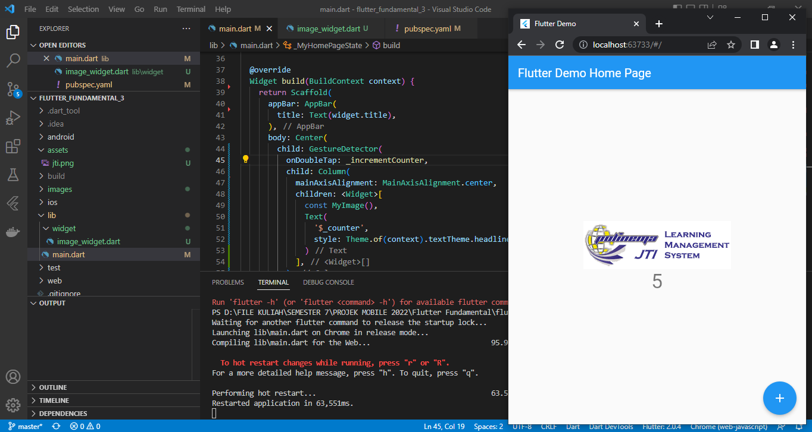
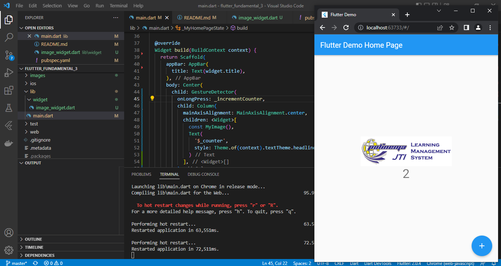
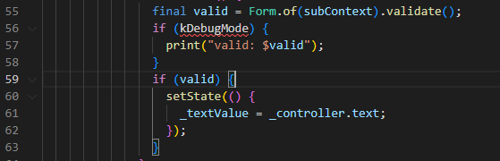
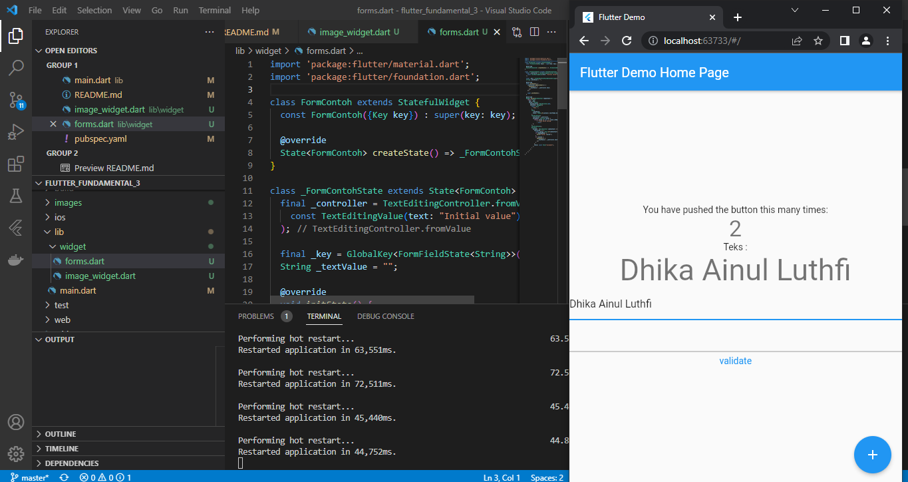
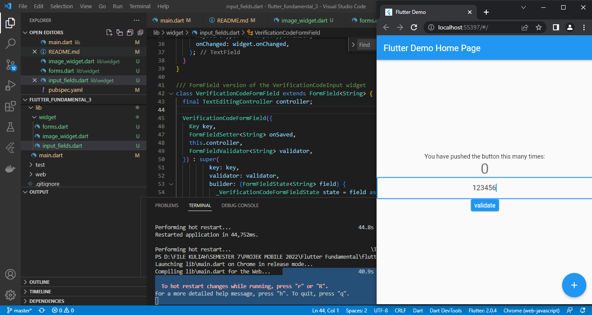

# flutter_fundamental_3

### Praktikum 1 : Menerapkan Gesture Detector

1. Saat menggunakan gesture detector onTap maka setiap 1 kali klik pada gambar akan menampilkan angka dengan penambahan nilai counter ++.

2. Saat menggunakan gesture detector onDoubleTap maka setiap 2 kali klik pada gambar maka akan menampilkan angka dengan penambahan nilai counter ++.

3. Saat menggunakan gesture detector onLongPress maka setiap melakukan klik pada gambar maka akan ada jeda yang lumayan panjang dalam hal menampilkan angka dengan penambahan nilai counter ++.

### Praktikum 2: Menerapkan Input Widget dan Forms

1. Terdapat error di source code pada line 56 pada kondisi if

2. Dengan menambahkan import 'package:flutter/foundation.dart'; maka error pada kondisi if akan hilang

### Praktikum 3: Menerapkan Custom Input dan FormField Widget

1. Maka akan tampil form yang dapat memasukkan angka dari 0 - 9 saja dengan batas 6 karakter

